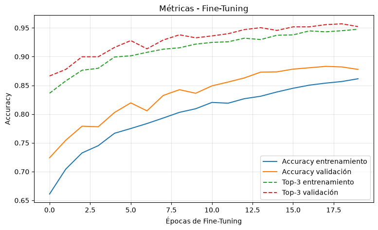
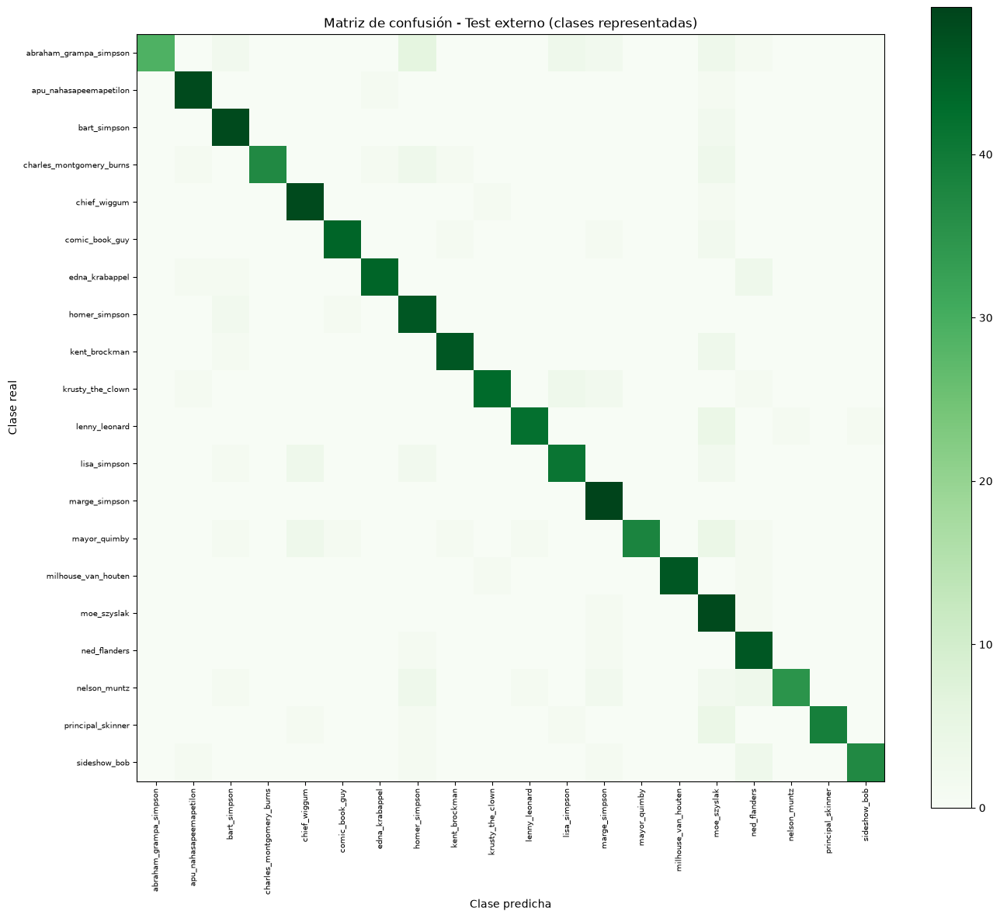

# Reconocimiento de personajes de Los Simpsons

Aplicación local de visión artificial que detecta y reconoce personajes de Los Simpsons en imágenes y videos.

El proyecto utiliza un detector YOLO personalizado para localizar personajes y un clasificador MobileNetV2 para identificar cada región. En videos se aplica seguimiento y consenso temporal para mantener predicciones más estables entre frames.

## Funcionalidades

- Carga de una imagen o un video por ejecución.
- Detección automática de posibles personajes.
- Clasificación entre 42 personajes conocidos.
- Seguimiento temporal para estabilizar las predicciones en video.
- Video anotado que conserva el audio original.
- Imagen resumen con una miniatura por personaje reconocido.
- Umbrales de confianza configurables desde Gradio.
- Indicador de progreso durante el procesamiento.

## Archivos necesarios

La aplicación requiere los siguientes archivos:

| Archivo | Descripción |
|---|---|
| `app.py` | Aplicación y pipeline de inferencia |
| `requirements.txt` | Dependencias de Python |
| `models/modelo_final_simpsons.keras` | Clasificador de personajes |
| `models/yolo_simpsons_best.pt` | Detector YOLO personalizado |
| `models/class_indices_simpsons.json` | Correspondencia entre salidas y personajes |
| `models/pipeline_config.json` | Parámetros de detección y consenso temporal |

## Instalación

### Windows PowerShell

```powershell
python -m venv .venv
.venv\Scripts\Activate.ps1
python -m pip install --upgrade pip
pip install -r requirements.txt
```

### Linux o macOS

```bash
python3 -m venv .venv
source .venv/bin/activate
python -m pip install --upgrade pip
pip install -r requirements.txt
```

## Ejecución

Con el entorno virtual activado:

```bash
python app.py
```

Gradio mostrará una dirección local similar a:

```text
http://127.0.0.1:7860
```

Abre esa dirección en el navegador para utilizar la aplicación.

## Uso

1. Selecciona una imagen o un video.
2. Mantén los valores de confianza predeterminados o ajústalos según el archivo.
3. Presiona **Analizar archivo**.
4. Espera a que finalice el procesamiento.
5. Revisa el archivo anotado, los personajes únicos reconocidos y el resumen.

## Formatos compatibles

### Imágenes

```text
JPG, JPEG, PNG, BMP y WEBP
```

### Videos

```text
MP4, AVI, MOV, MKV, WEBM, MPEG y MPG
```

Los videos procesados se convierten a MP4 con H.264 para facilitar su reproducción en el navegador.

## Controles de confianza

- **Confianza mínima YOLO:** controla qué detecciones se consideran regiones candidatas.
- **Confianza mínima del clasificador:** controla qué predicciones individuales se aceptan directamente.

Los valores iniciales se cargan desde `models/pipeline_config.json`.

## Salidas

### Para imágenes

- Imagen anotada.
- Imagen resumen de personajes únicos.
- Resumen textual de detecciones.

### Para videos

- Video anotado con audio.
- Imagen resumen de personajes únicos.
- Resumen textual de detecciones y observaciones acumuladas.

Los identificadores utilizados por el seguimiento permanecen internos y no se muestran en la interfaz.

## Rendimiento de referencia

- Accuracy del clasificador en test externo: **86,26 %**.
- F1 ponderado del clasificador en test externo: **87,41 %**.
- F1 micro de presencia de personajes en seis videos: **80,00 %**.

Estas métricas son resultados de referencia. El rendimiento puede variar según la resolución, duración, compresión, movimiento, oclusión y tamaño de los personajes.

## Comportamiento del modelo

### Evolución durante el Fine-Tuning



La precisión de entrenamiento y validación aumenta de manera progresiva durante el Fine-Tuning. La validación termina cerca del 88 %, mientras que el Top-3 supera el 95 %. Esto indica que, cuando la primera predicción no es correcta, el personaje real suele encontrarse entre las alternativas con mayor probabilidad.

La separación entre las curvas de entrenamiento y validación también muestra que todavía existe una diferencia de generalización. El modelo aprende correctamente los patrones principales, pero algunas apariencias del video pueden diferir de las imágenes utilizadas durante el entrenamiento.

### Confusiones entre personajes



La diagonal concentra la mayoría de las predicciones correctas. Los valores fuera de la diagonal corresponden a personajes confundidos por similitudes visuales, encuadres parciales, fondos o cambios de escala.

Esta matriz utiliza las 20 clases representadas en el test externo. El clasificador completo contiene 42 clases, por lo que los personajes con pocos ejemplos o sin representación en este conjunto pueden tener un comportamiento menos estable. En video, YOLO y el consenso temporal reducen parte de este problema, pero no pueden corregir un recorte incorrecto o una clase con evidencia insuficiente.

## Limitaciones

- El clasificador solo puede identificar las 42 clases incluidas en su entrenamiento.
- Personajes pequeños, parcialmente ocultos o presentes durante pocos frames pueden no acumular evidencia suficiente.
- Las clases con menos ejemplos pueden producir predicciones menos estables.
- Una región incorrecta generada por YOLO puede afectar la clasificación.
- El procesamiento de video no está diseñado para ejecutarse en tiempo real.

## Aviso

Proyecto personal de experimentación con Deep Learning. Los personajes y elementos visuales de Los Simpsons pertenecen a sus respectivos titulares. El repositorio no distribuye el dataset de entrenamiento ni los videos utilizados para evaluar el modelo.
